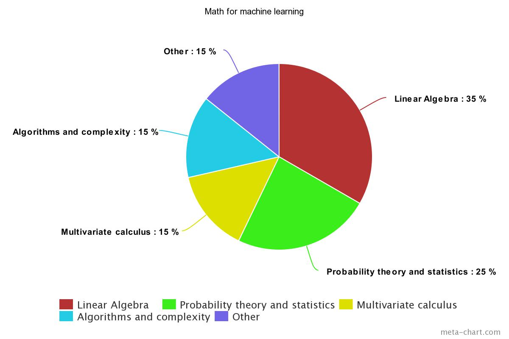

# math for machine learning

This is a course about math needed to learn machine learning

We will learn here following topics:

1. Linear Algebra
2. Probability theory and statistics
3. Multivariate calculus 
4. Algorithms and complexity
5. Others

Each has a contribution as per graph below:

## Useful resources and cheatsheets

1. There is a awesome list of resources [awesome-math](https://github.com/rossant/awesome-math) by [Cyrille Rossant
](https://github.com/rossant)
2. [Linear algebra explained in four pages](http://www.souravsengupta.com/cds2016/lectures/Savov_Notes.pdf)
3. [NO BULLSHIT GUIDE TO LINEAR ALGEBRA](https://gumroad.com/l/noBSLA)
4. [Calculus cheat sheet](http://tutorial.math.lamar.edu/pdf/Calculus_Cheat_Sheet_All.pdf)
5. [statistics cheet sheet](http://web.mit.edu/~csvoss/Public/usabo/stats_handout.pdf)
6. [Probability cheet sheet](https://static1.squarespace.com/static/54bf3241e4b0f0d81bf7ff36/t/55e9494fe4b011aed10e48e5/1441352015658/probability_cheatsheet.pdf)

## like it?

:star: this repo

## Contributors

PRs are welcomed.

## license

MIT © [priyanshujain](https://github.com/priyanshujain)
